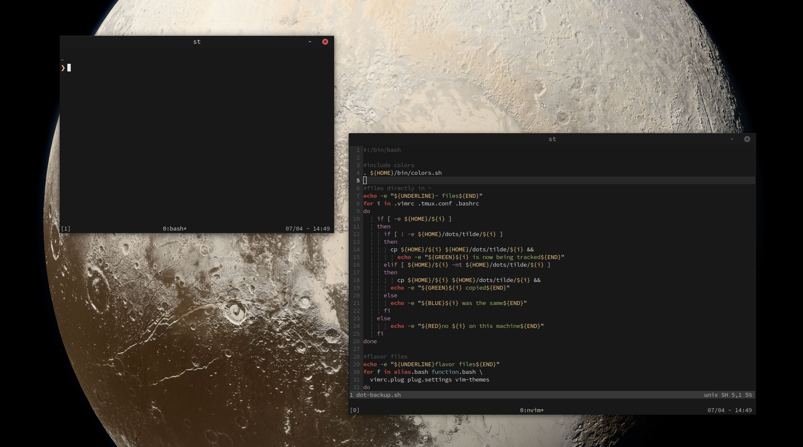

# dots

As soon as I started developing I became interested in making sure the machine I was working on for at least 8 hours a day felt pleasant to look at and worked well.

I'm amazed at the amount of ways you can tweak your machine and tools to work for you and to look the way you want. If not, then you can also freely build your own.

This is a growing collection of my dot files that serve to make my machine both pleasing to look at (for me), and function the way I want it to. These aren't meant to be placed and used on someone else's machine, but to serve as an example of one setup to hopefully give someone else ideas like the countless dot file repos I've scoured through.

  

